```mermaid
%%{init: {'theme':'base', 'themeVariables': {'primaryTextColor': '#ffffff', 'tertiaryTextColor': '#ffffff', 'sectionBkgColor': '#ffffff', 'altSectionBkgColor': '#ffffff', 'gridColor': '#777777', 'section0': '#ffffff', 'section1': '#ffffff', 'section2': '#ffffff', 'section3': '#ffffff', 'taskTextColor': '#ffffff', 'altTaskTextColor': '#ffffff', 'textColor': '#ffffff'}}}%%
gantt
    dateFormat X
    axisFormat %s

    section aa
    chr1_2-23 :0, 21
    section bb
    chr1_8-12 :6, 10
    chr1_14-15 :12, 13
    chr1_20-30 :18, 28
    section output1b
    chr1_2-23 :0, 21
    chr1_2-23 :0, 21
    chr1_2-23 :0, 21
```

```mermaid
%%{init: {'theme':'base', 'themeVariables': {'primaryTextColor': '#ffffff', 'tertiaryTextColor': '#ffffff', 'sectionBkgColor': '#ffffff', 'altSectionBkgColor': '#ffffff', 'gridColor': '#777777', 'section0': '#ffffff', 'section1': '#ffffff', 'section2': '#ffffff', 'section3': '#ffffff', 'taskTextColor': '#ffffff', 'altTaskTextColor': '#ffffff', 'textColor': '#ffffff'}}}%%
gantt
    dateFormat X
    axisFormat %s

    section aa
    chr1_2-23 :0, 21
    section bb
    chr1_8-12 :6, 10
    chr1_14-15 :12, 13
    chr1_20-30 :18, 28
    section output1c
    chr1_2-23 :0, 21
    chr1_8-12 :6, 10
    chr1_14-15 :12, 13
    chr1_20-30 :18, 28
```

```mermaid
%%{init: {'theme':'base', 'themeVariables': {'primaryTextColor': '#ffffff', 'tertiaryTextColor': '#ffffff', 'sectionBkgColor': '#ffffff', 'altSectionBkgColor': '#ffffff', 'gridColor': '#777777', 'section0': '#ffffff', 'section1': '#ffffff', 'section2': '#ffffff', 'section3': '#ffffff', 'taskTextColor': '#ffffff', 'altTaskTextColor': '#ffffff', 'textColor': '#ffffff'}}}%%
gantt
    dateFormat X
    axisFormat %s

    section aa
    chr1_2-23 :0, 21
    section bb
    chr1_8-12 :6, 10
    chr1_14-15 :12, 13
    chr1_20-30 :18, 28
    section output2
    chr1_8-12 :6, 10
    chr1_14-15 :12, 13
    chr1_20-23 :18, 21
```

```mermaid
%%{init: {'theme':'base', 'themeVariables': {'primaryTextColor': '#ffffff', 'tertiaryTextColor': '#ffffff', 'sectionBkgColor': '#ffffff', 'altSectionBkgColor': '#ffffff', 'gridColor': '#777777', 'section0': '#ffffff', 'section1': '#ffffff', 'section2': '#ffffff', 'section3': '#ffffff', 'taskTextColor': '#ffffff', 'altTaskTextColor': '#ffffff', 'textColor': '#ffffff'}}}%%
gantt
    dateFormat X
    axisFormat %s

    section aa
    chr1_2-23 :0, 21
    section bb
    chr1_8-12 :6, 10
    chr1_14-15 :12, 13
    chr1_20-30 :18, 28
    section output-subtract
    chr1_2-8 :0, 6
    chr1_12-14 :10, 12
    chr1_15-20 :13, 18
```

```mermaid
%%{init: {'theme':'base', 'themeVariables': {'primaryTextColor': '#ffffff', 'tertiaryTextColor': '#ffffff', 'sectionBkgColor': '#ffffff', 'altSectionBkgColor': '#ffffff', 'gridColor': '#777777', 'section0': '#ffffff', 'section1': '#ffffff', 'section2': '#ffffff', 'section3': '#ffffff', 'taskTextColor': '#ffffff', 'altTaskTextColor': '#ffffff', 'textColor': '#ffffff'}}}%%
gantt
    dateFormat X
    axisFormat %s

    section aa
    chr1_2-23 :0, 21
    section bb
    chr1_8-12 :6, 10
    chr1_14-15 :12, 13
    chr1_20-30 :18, 28
    section output6
    chr1_2-23 :0, 21
```

```mermaid
%%{init: {'theme':'base', 'themeVariables': {'primaryTextColor': '#ffffff', 'tertiaryTextColor': '#ffffff', 'sectionBkgColor': '#ffffff', 'altSectionBkgColor': '#ffffff', 'gridColor': '#777777', 'section0': '#ffffff', 'section1': '#ffffff', 'section2': '#ffffff', 'section3': '#ffffff', 'taskTextColor': '#ffffff', 'altTaskTextColor': '#ffffff', 'textColor': '#ffffff'}}}%%
gantt
    dateFormat X
    axisFormat %s

    section aa
    chr1_2-23 :0, 21
    section bb
    chr1_8-12 :6, 10
    chr1_14-15 :12, 13
    chr1_20-30 :18, 28
    section output7
    chr1_8-12 :6, 10
    chr1_20-23 :18, 21
```

<div class="fixed-bed-files">
  <div class="file-section">
    <h4>aa.bed</h4>
    <pre>chr1 2 23</pre>
  </div>
  <div class="file-section">
    <h4>bb.bed</h4>
    <pre>chr1 8 12
chr1 14 15
chr1 20 30</pre>
  </div>
</div>

Here we show examples of how `bedder` can perform intersections. All examples uses these files (also shown to the right):

#### aa.bed

```

chr1 2 23

```

#### bb.bed

```

chr1 8 12
chr1 14 15
chr1 20 30

```

---

# Reporting Piece

For, now, we focus on which part of each interval that is reported. The options for this are:

```

  -p, --a-piece <A_PIECE>
          a-piece [default: whole] [possible values: none, piece, whole, inverse, whole-wide]
      --b-piece <B_PIECE>
          b-piece [default: whole] [possible values: none, piece, whole, inverse, whole-wide]

```

---

Let's start with reporting a single line for the `a` interval if it overlaps using `whole-wide` and _none_ of the `b` interval:

```

$ bedder intersect -a tests/examples/aa.bed -b tests/examples/bb.bed -g tests/examples/fake.fai --a-piece whole-wide --b-piece none
chr1    2       23

```


---

Using `--a-piece whole` instead reports one line per overlap (the `a` interval is repeated for each `b` it overlaps):

```

$ bedder intersect -a tests/examples/aa.bed -b tests/examples/bb.bed -g tests/examples/fake.fai --a-piece whole --b-piece none
chr1    2       23
chr1    2       23
chr1    2       23

```



---

We can also use `--a-piece whole` with `--b-piece whole` to see which `b` intervals each `a` overlaps:

```

$ bedder intersect -a tests/examples/aa.bed -b tests/examples/bb.bed -g tests/examples/fake.fai --a-piece whole --b-piece whole
chr1    2       23      chr1    8       12
chr1    2       23      chr1    14      15
chr1    2       23      chr1    20      30

```



---

Now, we report the *piece*s of the `a` interval along with the _whole_ `b` interval that it overlapped:

```

$ bedder intersect -a tests/examples/aa.bed -b tests/examples/bb.bed -g tests/examples/fake.fai --a-piece piece --b-piece whole
chr1    8       12      chr1    8       12
chr1    14      15      chr1    14      15
chr1    20      23      chr1    20      30

```



---

And now the _piece_ of `a` and the `piece` of `b`:

```

$ bedder intersect -a tests/examples/aa.bed -b tests/examples/bb.bed -g tests/examples/fake.fai --a-piece piece --b-piece piece
chr1    8       12      chr1    8       12
chr1    14      15      chr1    14      15
chr1    20      23      chr1    20      23

```


---

We can also report the `inverse`, that is, parts of `a` that do not overlap `b`:

```

$ bedder intersect -a tests/examples/aa.bed -b tests/examples/bb.bed -g tests/examples/fake.fai --a-piece inverse --b-piece none
chr1    2       8
chr1    12      14
chr1    15      20

```


### Replicating `bedtools subtract`

To reproduce:

```
$ bedtools subtract -a aa.bed -b bb.bed
chr1    2       8
chr1    12      14
chr1    15      20
```

Use `bedder` with `--a-piece inverse --b-piece none`:

```
$ bedder intersect -a aa.bed -b bb.bed -g fake.fai --a-piece inverse --b-piece none
chr1    2       8
chr1    12      14
chr1    15      20
```



---

There are other many combinations of parameters, some of which are not very helpful!

---

# Overlap Requirements

The default in bedder is that a single base of overlap is sufficient to report. However we can add constraints to this with these arguments:

```

  -r, --a-requirements <A_REQUIREMENTS>
          a-requirements for overlap. A float value < 1 or a number ending with % will be the fraction (or %) of the interval. An integer will be the number of bases. [default: 1]
  -R, --b-requirements <B_REQUIREMENTS>
          b-requirements for overlap. A float value < 1 or a number ending with % will be the fraction (or %) of the interval. An integer will be the number of bases. [default: 1]

```

Here is the default, requiring a single base of overlap:

```

$ bedder intersect -a tests/examples/aa.bed -b tests/examples/bb.bed -g tests/examples/fake.fai --a-piece piece --b-piece none --a-requirements 1
chr1    8       12
chr1    14      15
chr1    20      23

```


---

We can update that to require at least 3 bases:

```

$ bedder intersect -a tests/examples/aa.bed -b tests/examples/bb.bed -g tests/examples/fake.fai --a-piece whole-wide --b-piece whole-wide --a-requirements 3 --a-mode piece
chr1    2       23      chr1    8       12      chr1    20      30

```



---

We can also report each a piece:

```

$ bedder intersect -a tests/examples/aa.bed -b tests/examples/bb.bed -g tests/examples/fake.fai --a-piece piece --b-piece whole --b-requirements 3 --a-mode piece
chr1    8       12      chr1    8       12
chr1    20      23      chr1    20      30

```



---

If we don't specify `--a-mode piece` then it checks across the entire interval so each _piece_ of `a` is reported even though one of the pieces is not 3 bases:

```

$ bedder intersect -a tests/examples/aa.bed -b tests/examples/bb.bed -g tests/examples/fake.fai --a-piece piece --b-piece whole --b-requirements 3
chr1    8       12      chr1    8       12
chr1    14      15      chr1    14      15
chr1    20      23      chr1    20      30

```


---

### Python functions

We can output custom columns with python functions. The python function must accept a fragment, part of an overlap, and have a return type of `str`, `int`, `bool` or `float`.
The function must begin with `bedder_`. For example, we can have a function like this that will return the number of `b` intervals overlapping the `a` interval:

```python
def bedder_n_overlapping(fragment) -> int:
    return len(fragment.b)
```

This tells `bedder` that the return type will be an integer. And the user will refer to the function as `py:n_overlapping` (without arguments).

---

We put this in a file called `example.py` and then run with an argument of `-c py:n_overlapping` as:

```
$ bedder intersect -a tests/examples/aa.bed -b tests/examples/bb.bed -g tests/examples/fake.fai --a-piece whole-wide --b-piece piece --python tests/examples/example.py -c 'py:n_overlapping'
chr1    2       23      chr1    8       12      chr1    14      15      chr1    20      23      3
```


Where the final column shows the expected value of _3_.

---

Another example is that total bases of `b` that overlap an `a` interval:

```python
def bedder_total_b_overlap(fragment) -> int:
    return sum(b.stop - b.start for b in fragment.b)
```

And call as:

```
$ bedder intersect -a tests/examples/aa.bed -b tests/examples/bb.bed -g tests/examples/fake.fai --a-piece whole-wide --b-piece piece --python tests/examples/example.py -c 'py:total_b_overlap'
chr1    2       23      chr1    8       12      chr1    14      15      chr1    20      23      8
```


---

Note that if we change the `--b-piece` to `whole-wide` we get a different value as expected:

```
$ bedder intersect -a tests/examples/aa.bed -b tests/examples/bb.bed -g tests/examples/fake.fai --a-piece whole-wide --b-piece whole-wide --python tests/examples/example.py -c 'py:total_b_overlap'
chr1    2       23      chr1    8       12      chr1    14      15      chr1    20      30      15
```


---

and likewise if we change `--a-piece` to piece:

```
$ bedder intersect -a tests/examples/aa.bed -b tests/examples/bb.bed -g tests/examples/fake.fai --a-piece piece --b-piece whole --python tests/examples/example.py -c 'py:total_b_overlap'
chr1    8       12      chr1    8       12      4
chr1    14      15      chr1    14      15      1
chr1    20      23      chr1    20      30      10
```


---

# VCF and getting to the concrete type

Until now, we have relied on the generic trait methods `chrom`, `start`, `stop` in the `python` functions, but we also have access to the concrete types.
For example, if we know it's a vcf, we can access the underlying variant and only count the depth if the filter is pass:

```python
def bedder_vcf_dp(fragment) -> int:
    """return depth (DP) of passing variant"""
    v = fragment.a.vcf() # get the concrete type
    if not "PASS" in v.filters: return 0
    return v.info("DP")
```
